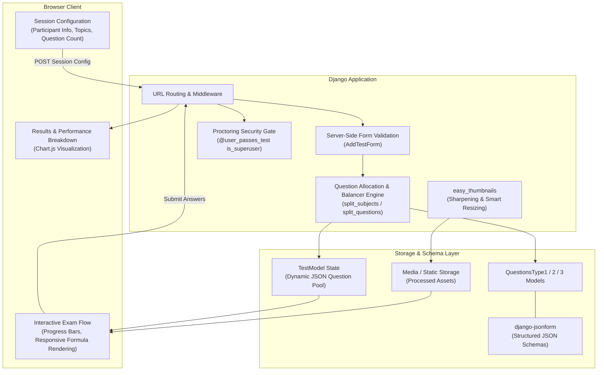

# Adaptive Knowledge Assessment & Exam Engine

<p align="center">
  <strong>High-performance, configurable web assessment engine with dynamic JSON-schema question modeling, automated media thumbnailing, and real-time score analytics</strong>
</p>

<p align="center">
  <a href="README.md"><b>English</b></a> | <a href="README.ru.md"><b>Русский</b></a>
</p>

<p align="center">
  
  
  
  
  
  
</p>

---

## 📖 Executive Overview

**Adaptive Knowledge Assessment & Exam Engine** is an enterprise-grade testing and qualification examination platform built with **Django**. It enables training departments, universities, and corporate assessment centers to conduct automated, rigorous technical evaluations across diverse domain disciplines.

The engine addresses the complexity of modern STEM and technical testing: rather than restricting assessments to plain-text multiple choice, it natively accommodates mathematical formulas, graphical assets, circuit diagrams, and rich media options through a unified, schema-validated database architecture.

---

## 📸 Visual Walkthrough

### Dynamic Admin Management (`django-jsonform`)
<p align="center">
  
</p>

### Assessment Initialization & Topic Allocation
<p align="center">
  
</p>

### Interactive Exam View with Automated Media Scaling (`easy_thumbnails`)
<p align="center">
  
</p>

---

## ⚡ Key Engineering Highlights

### 1. Multi-Format Question Architecture & Dynamic Admin Schemas (`django-jsonform`)
Content administrators can author complex question types without writing database migrations:
* **Type 1 (Text Multiple Choice)**: Standard questions with variable choice count (2 to 6 options) validated by a dynamic JSON Schema.
* **Type 2 (Formula / Image Options)**: Mathematical questions where options are images or formula snippets with interactive file uploads (`file-url` widget) directly in the admin panel.
* **Type 3 (Visual Problem Solving)**: Complex graphical questions with an attached illustration/diagram and selectable answers.

### 2. Automated Server-Side Media Processing (`easy_thumbnails`)
* Integrates `ThumbnailerImageField` and custom thumbnail aliases to automate resizing, smart autocropping, and high-fidelity sharpening (`quality: 100`, `sharpen: True`).
* Guarantees that formulas and technical schematics render crisp and legible on desktop, tablet, and mobile displays without layout breakage.

### 3. Server-Side Validation & Balanced Pool Generation
* **Custom Question Splitting Algorithm**: Automatically balances questions across selected topics and question difficulties (`split_subjects`, `split_questions`).
* **Server-Side Validation**: Ensures participant registration, topic consistency, and question thresholds before provisioning the exam session.
* **State Preservation**: Serializes active exam state into JSON within `TestModel`, tracking question order, time, answers, and progress dynamically.

### 4. Real-Time Score Visualization & Interactive Breakdown (`Chart.js`)
* Real-time progress indicators throughout testing (percentage answered, current score trajectory).
* Comprehensive post-exam diagnostic review with interactive score distribution rendered via **Chart.js**.
* Dynamic chromatic feedback adapting UI color based on grade threshold.

### 5. Security & Proctoring Safeguards
* **Environment Isolation**: Sensitive configuration (`SECRET_KEY`, `DEBUG`, `ALLOWED_HOSTS`) decoupled into `.env` with a version-controlled `.env.template`.
* **Guarded Proctoring Endpoint**: Administrative inspection endpoint (`/test/bober`) secured with `@user_passes_test(lambda u: u.is_authenticated and u.is_superuser)` to prevent answer leaks to unauthenticated or regular test-takers.

---

## 🏛️ System Architecture & Data Flow



---

## 📂 Project Structure

```
quiztes/
├── quiztes/                  # Project configuration & settings
│   ├── settings.py           # Environment-configured settings (SECRET_KEY, DEBUG)
│   ├── urls.py               # Root URL routing
│   ├── wsgi.py               # WSGI production entrypoint
│   └── asgi.py               # ASGI asynchronous entrypoint
├── main/                     # Core testing application
│   ├── models.py             # Subject, TestModel, QuestionsType 1/2/3
│   ├── views.py              # Test orchestration, question renderer, secured proctor view
│   ├── forms.py              # Participant setup & topic selection form
│   ├── admin.py              # django-jsonform administrative interface
│   ├── static/               # CSS, JavaScript (Bootstrap 5, Chart.js, jQuery)
│   └── migrations/           # Database migration history
├── templates/                # Responsive HTML5 presentation templates
│   └── main/                 # Layout, questions, results, about, author
├── media/                    # Question illustrations & scaled thumbnails
├── .env.template             # Environment variables blueprint
├── requirements.txt          # Python dependencies
└── manage.py                 # Django management CLI
```

---

## 🚀 Setup & Installation Guide

### 1. Prerequisites
* Python 3.10 or higher
* Git

### 2. Clone Repository & Setup Virtual Environment
```bash
# Navigate to directory
cd quiztes

# Create virtual environment
python -m venv venv

# Activate virtual environment
# On Linux/macOS:
source venv/bin/activate
# On Windows (PowerShell):
.\venv\Scripts\Activate.ps1
```

### 3. Install Dependencies
```bash
pip install -r requirements.txt
```

### 4. Configure Environment Variables
Copy `.env.template` to `.env`:
```bash
cp .env.template .env
```

Edit `.env`:
```env
SECRET_KEY=your-secure-random-secret-key
DEBUG=True
ALLOWED_HOSTS=127.0.0.1,localhost
```

### 5. Apply Migrations & Initialize Superuser
```bash
python manage.py migrate
python manage.py createsuperuser
```

### 6. Run the Development Server
```bash
python manage.py runserver
```

Navigate to:
* **Assessment Portal**: `http://127.0.0.1:8000/`
* **Admin Schema Panel**: `http://127.0.0.1:8000/admin/`

---

## 📄 License
This project is open-source and licensed under the **MIT License**.
