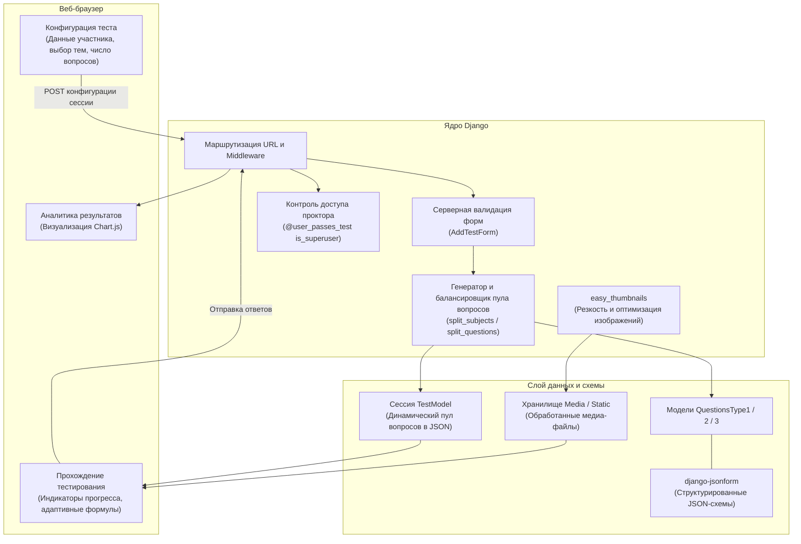

# Adaptive Knowledge Assessment & Exam Engine (Теория электросвязи)

<p align="center">
  <strong>Высокопроизводительная веб-платформа тестирования знаний по дисциплине «Теория электросвязи» (ТЭС) с динамическими JSON-схемами вопросов, масштабированием медиа и интерактивной аналитикой</strong>
</p>

<p align="center">
  <a href="README.md"><b>English</b></a> | <a href="README.ru.md"><b>Русский</b></a>
</p>

<p align="center">
  
  
  
  
  
  
</p>

---

## 📖 Обзор платформы

**Adaptive Knowledge Assessment & Exam Engine** — это корпоративная веб-платформа для проведения тестирования, аттестации и квалификационных экзаменов, разработанная на **Django**. Система предназначена для корпоративных учебных центров, образовательных учреждений и отделов оценки персонала, обеспечивая автоматизированную и строгую проверку знаний по техническим дисциплинам.

Платформа решает критическую проблему тестирования в инженерных и точных науках: вместо ограничения простыми текстовыми вариантами ответов, движок нативно поддерживает сложные математические формулы, графические схемы, чертежи и медиа-вопросы благодаря гибкой архитектуре на базе валидируемых JSON-схем.

---

## 📸 Визуальный обзор интерфейса

### Управление вопросами в админ-панели (`django-jsonform`)
<p align="center">
  
</p>

### Регистрация тестируемого и выбор тем
<p align="center">
  
</p>

### Прохождение теста и автоматическое масштабирование медиа (`easy_thumbnails`)
<p align="center">
  
</p>

---

## ⚡ Ключевые инженерные особенности

### 1. Мультиформатная архитектура вопросов и динамические схемы (`django-jsonform`)
Администраторы и методисты могут создавать сложные типы вопросов без необходимости писать новые миграции БД:
* **Тип 1 (Текстовый выбор)**: Стандартные вопросы с переменным числом вариантов ответа (от 2 до 6), валидируемые динамической JSON Schema.
* **Тип 2 (Формулы и графические варианты)**: Математические вопросы, где вариантами ответов выступают формулы или изображения, загружаемые через интерактивный виджет (`file-url`) прямо в админке.
* **Тип 3 (Визуальный анализ)**: Комплексные задания с прикрепленной схемой/иллюстрацией к вопросу и выбором вариантов ответа.

### 2. Автоматическая обработка и оптимизация медиа (`easy_thumbnails`)
* Использование `ThumbnailerImageField` и преднастроенных алиасов для автоматического ресайзинга, умного кадрирования и увеличения резкости (`quality: 100`, `sharpen: True`).
* Гарантирует чёткое и разборчивое отображение математических индексов и мелких деталей схем на любых экранах без искажения верстки.

### 3. Серверная валидация и сбалансированная генерация пула вопросов
* **Алгоритм распределения вопросов**: Автоматически балансирует вопросы по выбранным темам и категориям сложности (`split_subjects`, `split_questions`).
* **Серверная валидация**: Контролирует корректность ввода данных участника, непротиворечивость выбранных тем и соответствие минимальным лимитам перед запуском сессии.
* **Сериализация состояния**: Сохраняет прогресс тестирования в JSON-поле модели `TestModel`, отслеживая порядок вопросов, затраченное время, историю ответов и правильность.

### 4. Аналитика результатов и визуализация в реальном времени (`Chart.js`)
* Индикаторы прогресса в процессе прохождения (процент пройденных вопросов, текущий темп).
* Итоговая страница с интерактивной круговой диаграммой распределения баллов на базе **Chart.js**.
* Динамическая цветовая индикация страницы в зависимости от набранного балла и критериев оценки.

### 5. Безопасность и защита от компрометации ответов
* **Изоляция конфигурации**: Секретные ключи (`SECRET_KEY`, `DEBUG`, `ALLOWED_HOSTS`) вынесены в переменные окружения через `.env` и шаблон `.env.template`.
* **Защищённый прокторский эндпоинт**: Служебная страница просмотра правильных ответов (`/test/bober`) защищена декоратором `@user_passes_test(lambda u: u.is_authenticated and u.is_superuser)`, исключая утечку ключей тестируемым.

---

## 🏛️ Архитектура системы и потоки данных



---

## 📂 Структура проекта

```
quiztes/
├── quiztes/                  # Конфигурация и настройки проекта
│   ├── settings.py           # Настройки с поддержкой .env (SECRET_KEY, DEBUG)
│   ├── urls.py               # Корневые маршруты URL
│   ├── wsgi.py               # Точка входа WSGI
│   └── asgi.py               # Точка входа ASGI
├── main/                     # Основное приложение тестирования
│   ├── models.py             # Модели Subject, TestModel, QuestionsType 1/2/3
│   ├── views.py              # Логика тестирования, рендеринг вопросов, закрытый проктор-вид
│   ├── forms.py              # Форма регистрации участника и выбора тем
│   ├── admin.py              # Админ-панель на базе django-jsonform
│   ├── static/               # CSS, JavaScript (Bootstrap 5, Chart.js, jQuery)
│   └── migrations/           # История миграций БД
├── templates/                # Адаптивные шаблоны интерфейса HTML5
│   └── main/                 # Разметка вопросов, результатов, о программе, авторы
├── media/                    # Иллюстрации к вопросам и оптимизированные миниатюры
├── .env.template             # Образец переменных окружения
├── requirements.txt          # Зависимости Python
└── manage.py                 # CLI управления Django
```

---

## 🚀 Руководство по установке и запуску

### 1. Предварительные требования
* Python 3.10 или выше
* Git

### 2. Клонирование и настройка виртуального окружения
```bash
# Переход в папку с проектом
cd quiztes

# Создание виртуального окружения
python -m venv venv

# Активация виртуального окружения
# Для Linux/macOS:
source venv/bin/activate
# Для Windows (PowerShell):
.\venv\Scripts\Activate.ps1
```

### 3. Установка зависимостей
```bash
pip install -r requirements.txt
```

### 4. Настройка переменных окружения
Скопируйте `.env.template` в `.env`:
```bash
cp .env.template .env
```

Отредактируйте `.env`:
```env
SECRET_KEY=your-secure-random-secret-key
DEBUG=True
ALLOWED_HOSTS=127.0.0.1,localhost
```

### 5. Применение миграций и создание суперпользователя
```bash
python manage.py migrate
python manage.py createsuperuser
```

### 6. Запуск сервера разработки
```bash
python manage.py runserver
```

Откройте в браузере:
* **Портал тестирования**: `http://127.0.0.1:8000/`
* **Админ-панель управления схемами**: `http://127.0.0.1:8000/admin/`

---

## 📄 Лицензия
Проект распространяется под открытой лицензией **MIT License**.
